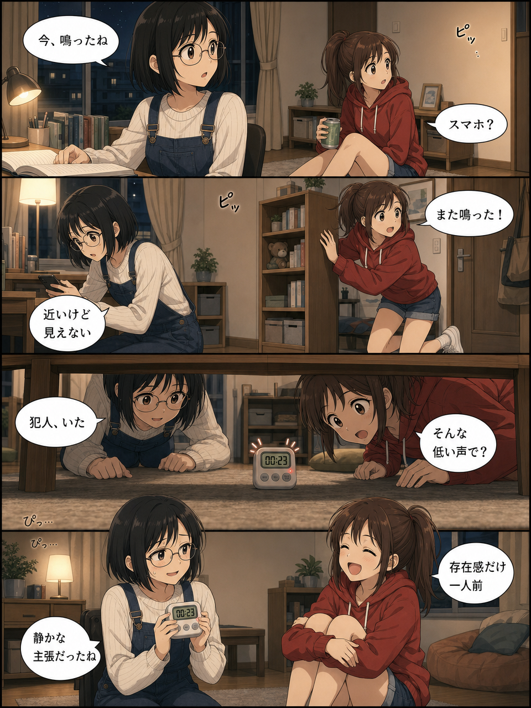
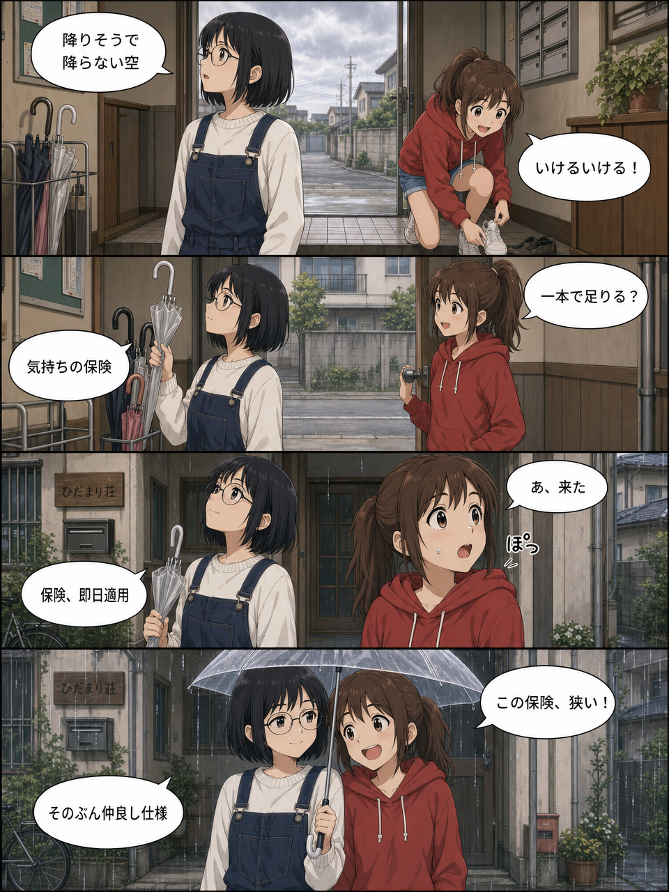

# yonkomatic

**yonkomatic** = 四コマ (yonkoma) + automatic.

AI が毎日 4 コマ漫画を描き、Slack / 静的サイトへ自動投稿する OSS テンプレート。

> **Status:** Step 7 (OSS 公開準備) 着手中。7a〜7d (gh-pages 分離 / 自動リトライ / CONTRIBUTING / pytest+CI) は完了、本 README は 7e の成果物。
> 進捗は [`ROADMAP.md`](ROADMAP.md)、設計仕様の履歴は [`SPEC.md`](SPEC.md) を参照 (現行仕様の単一ソースは ROADMAP)。

## Demo

**ライブデモ** — このリポジトリを fork して 1 日 1 話の自動投稿が走り続けている公開リポジトリ:

- ライブサイト: <https://www.jumboly.jp/yonkomatic-demo/>
- demo リポジトリ: <https://github.com/jumboly/yonkomatic-demo>

upstream (このリポジトリ) と同じコードベースに、後述のサンプル素材だけを使い、毎週月〜日に新しい 4 コマが追加されます。挙動・出力品質・運用コストの実例として参照してください。

実際に gpt-image-2 が出力した本番品質サンプル (W21、960×1280):

| ep4 「静かな通知音」 | ep5 「傘の待機列」 |
| --- | --- |
|  |  |
| 夜の部屋でかすかな電子音の正体を探す。便利なものほど、思わぬところで存在感を出してくる。 | 空があやしい昼下がり、玄関で傘をどうするか相談する。降る前の迷い方に、それぞれの性格が出る。 |

自分の fork で同等のサイトを立てる手順は [`SETUP.md`](SETUP.md) §10 を参照 (上流テンプレでは cron 停止のため deploy されません)。

## Quick Start

```bash
# 1. fork してクローン (前提: gh CLI 認証済み。詳細は SETUP.md)
gh repo fork jumboly/yonkomatic --clone --remote
cd yonkomatic

# 2. 依存関係インストール
uv sync

# 3. .env を準備
cp .env.example .env
# OPENAI_API_KEY, SLACK_BOT_TOKEN, SLACK_CHANNEL_ID を埋める

# 4. 自前素材を持ち込む (任意)
# content/prompt.md と content/images/ を自分のキャラ・世界観で書き換える。
# 同梱サンプルがそのまま入っているのでスキップしてもまず動く。

# 5. ローカル動作確認
uv run yonkomatic test slack            # Slack 疎通
uv run yonkomatic test panel            # シナリオ → text LLM → 画像 1 枚生成
```

実際の自動投稿を始めるには fork 先で Secrets と cron を有効化します。詳細は [`SETUP.md`](SETUP.md) を参照。

## How it works

週次 + 日次の 2 段パイプラインで動きます。

```
[週次 cron]
  scenario_prompt.md ──▶ OpenAI gpt-5.4 (Structured Output) ──▶ 7 話分の YAML
                                                                ──▶ 画像 batch 投入 (50% off)

[日次 cron]
  当日のエピソード ──▶ panel_prompt.md 展開 ──▶ gpt-image-2 で 1 枚生成 (preflight があれば再利用)
                                              ──▶ Publisher Protocol で並列投稿 (Slack / 静的サイト)
```

| 領域 | 採用 |
| ---- | ---- |
| 実行基盤 | GitHub Actions (cron — fork 先で有効化、生成物は gh-pages branch) |
| シナリオ生成 | OpenAI gpt-5.4 (Structured Output) |
| 画像生成 | OpenAI gpt-image-2 (960×1280, batch 50% off + 失敗時自動リトライ) |
| 投稿先 | Slack / 静的サイト (Publisher Protocol で抽象化、Discord は将来対応) |
| 言語 | Python 3.12+, uv |

content の構造 (1 ディレクトリで完結):

```
content/
  prompt.md          # キャラクター / 世界観 / 画風
  images/            # キャラ参考画像 (PNG/JPEG/WebP、サブディレクトリ自由)
```

## このリポジトリの位置付け

このリポジトリ (`jumboly/yonkomatic`) は **テンプレート専用** で、cron は停止しています。実運用するには **自分のリポジトリに fork** して、fork 先で Secrets / cron / 自前のキャラ素材を設定してください。

```
┌─────────────────────────────┐         ┌─────────────────────────────┐
│ upstream (このリポジトリ)    │         │ あなたの fork (private 推奨) │
│                              │  fork   │                              │
│ - コード / 仕様の単一ソース   │ ──────▶ │ - 自前の content/ 素材       │
│ - cron 停止                  │         │ - Secrets 設定済み            │
│ - PR で改善を上流に戻す       │         │ - cron 有効化、自動投稿       │
└─────────────────────────────┘         └─────────────────────────────┘
```

生成物 (`scenarios/` `output/` `state/` `docs/`) は main には commit されず、fork 先の `gh-pages` branch に bot が push します。main は常にコードのみ、上流追従が綺麗に保てます。

## リンク集

- [`SETUP.md`](SETUP.md) — fork から cron 起動までの完全手順
- [`CONTRIBUTING.md`](CONTRIBUTING.md) — 上流への貢献ルール / コーディング規約
- [`ROADMAP.md`](ROADMAP.md) — 現在地・次の Step・直近の決定事項 (作業前に必ず読む)
- [`SPEC.md`](SPEC.md) — 設計判断の履歴 (現行仕様は ROADMAP に集約済み)
- [`LICENSE`](LICENSE) — MIT

## ライセンス

[MIT License](LICENSE)
